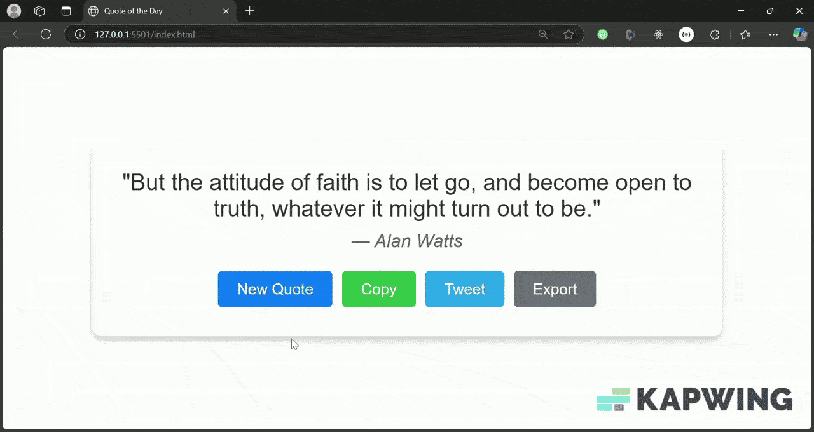

# Quote of the Day

A simple website that fetches and displays a random quote from the FreeAPI Quotes endpoint.

## Features

- Fetches and displays a random quote and author.
- "New Quote" button to fetch another quote.
- "Copy" button to copy quote to clipboard.
- "Tweet" button to share on Twitter.
- **Bonus:** Random background image from Unsplash.
- **Bonus:** "Export" button to save the quote as an image.

## Tech Stack

- **HTML5:** Structure.
- **CSS3:** Styling and responsiveness.
- **JavaScript:** Fetch API, clipboard, Twitter sharing, and image export.
- **html2canvas:** For exporting quote as an image.

## Demo

## Deployment

- Hosted on [Netlify/Vercel]: [https://your-deployed-link.com](#)
